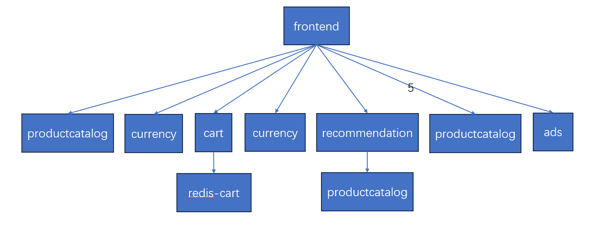
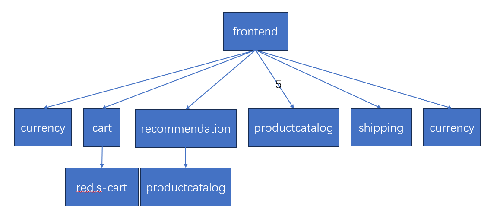
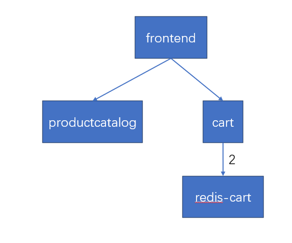
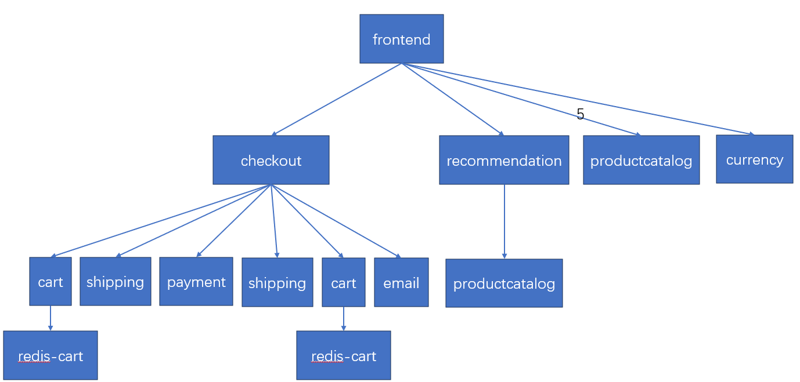

## Quickstart

```
git clone https://github.com/dufanrong/opentelemetry-microservices-demo.git
cd opentelemetry-microservices-demo
kubectl apply -n demo -Rf kubernetes-manifests/
```
如果要删除资源，执行
```
./delete.sh
```
---

## 请求类型
共有6种类型的请求


1. **index(l):**
```
curl http://frontend:80/
```

   - **HTTP请求类型：** GET
   - **URL路径：** "/"
   - **描述：** 访问网站的主页。

2. **setCurrency(l):**
```
curl -X POST -d 'currency_code=USD' http://frontend:80/setCurrency
```
   - **HTTP请求类型：** POST
   - **URL路径：** "/setCurrency"
   - **请求参数：** {'currency_code': '随机选择的货币代码'}
   - **描述：** 设置货币，通过向服务器发送包含随机选择的货币代码的POST请求来模拟。

3. **browseProduct(l):**
```
curl http://frontend:80/product/1YMWWN1N4O
```
   - **HTTP请求类型：** GET
   - **URL路径：** "/product/{随机选择的产品标识符}"
   - **描述：** 浏览网站上随机选择的产品，通过向服务器发送包含产品标识符的GET请求来模拟。

4. **viewCart(l):**
```
curl http://frontend:80/cart
```
   - **HTTP请求类型：** GET
   - **URL路径：** "/cart"
   - **描述：** 查看购物车，通过向服务器发送GET请求来获取购物车的内容。

5. **addToCart(l):**
```
# 第一个请求 - 浏览产品
curl http://frontend:80/product/1YMWWN1N4O

# 第二个请求 - 将产品添加到购物车
curl -X POST -H "Content-Type: application/json" -d '{"product_id": "1YMWWN1N4O", "quantity": 3}' http://frontend:80/cart

```
   - **HTTP请求类型：** 
     - 第一个请求：GET
     - 第二个请求：POST
   - **URL路径：** 
     - 第一个请求："/product/{随机选择的产品标识符}"
     - 第二个请求："/cart"
   - **请求参数：**
     - 第二个请求：{'product_id': '随机选择的产品标识符', 'quantity': 随机选择的数量}
   - **描述：** 将随机选择的产品添加到购物车中。首先，通过向服务器发送包含产品标识符的GET请求浏览产品，然后通过发送包含产品ID和数量的POST请求将其添加到购物车。

6. **checkout(l):**
```
# 第一个请求 - 浏览产品
curl http://frontend:80/product/1YMWWN1N4O

# 第二个请求 - 将产品添加到购物车
curl -X POST -H "Content-Type: application/json" -d '{"product_id": "1YMWWN1N4O", "quantity": 3}' http://frontend:80/cart

# 第三个请求 - 执行结账操作
curl -X POST -H "Content-Type: application/json" -d '{
    "email": "someone@example.com",
    "street_address": "1600 Amphitheatre Parkway",
    "zip_code": "94043",
    "city": "Mountain View",
    "state": "CA",
    "country": "United States",
    "credit_card_number": "4432-8015-6152-0454",
    "credit_card_expiration_month": "1",
    "credit_card_expiration_year": "2039",
    "credit_card_cvv": "672"
}' http://frontend:80/cart/checkout
```
   - **HTTP请求类型：** 
     - 第一个请求：GET
     - 第二个请求：POST
   - **URL路径：** 
     - 第一个请求："/product/{随机选择的产品标识符}"
     - 第二个请求："/cart/checkout"
   - **请求参数：**
     - 第二个请求：{
         'email': 'someone@example.com',
         'street_address': '1600 Amphitheatre Parkway',
         'zip_code': '94043',
         'city': 'Mountain View',
         'state': 'CA',
         'country': 'United States',
         'credit_card_number': '4432-8015-6152-0454',
         'credit_card_expiration_month': '1',
         'credit_card_expiration_year': '2039',
         'credit_card_cvv': '672',
       }
   - **描述：** 模拟购物流程，包括浏览产品、将产品添加到购物车，然后执行结账操作。首先，通过向服务器发送包含产品标识符的GET请求浏览产品，然后通过发送包含产品ID和数量的POST请求将其添加到购物车。最后，通过发送包含结账信息的POST请求完成结账过程。

## 每种请求的调用图
**setCurrency**
```
curl -X POST -d "currency_code=USD" http://10.96.48.250:80/setCurrency
```


**browseProduct**
```
curl http://10.96.48.250:80/product/1YMWWN1N4O
```


**viewCart**
```
curl http://10.96.48.250:80/cart
```


**addToCart**
```
curl -X POST -d "product_id=0PUK6V6EV0&quantity=3" http://10.96.48.250:80/cart
```


**checkout**
```
curl -X POST -d "email=someone@example.com&street_address=1600 Amphitheatre Parkway&zip_code=94043&city=Mountain View&state=CA&country=United States&credit_card_number=4432-8015-6152-0454&credit_card_expiration_month=1&credit_card_expiration_year=2039&credit_card_cvv=672" http://10.96.48.250:80/cart/checkout
```
